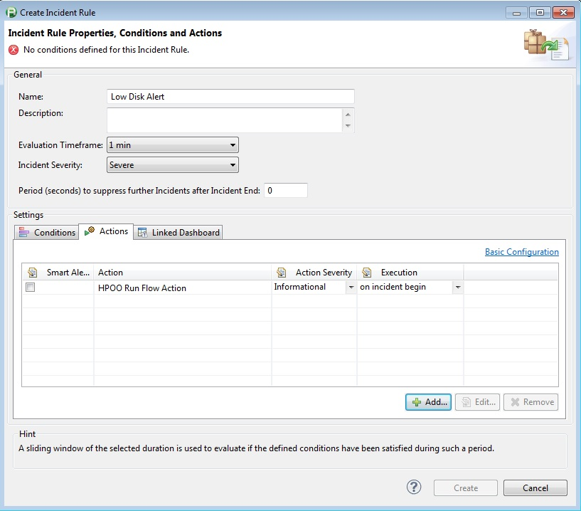
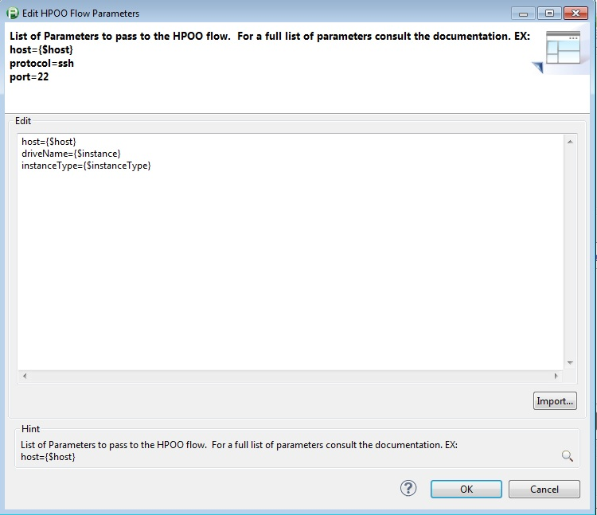
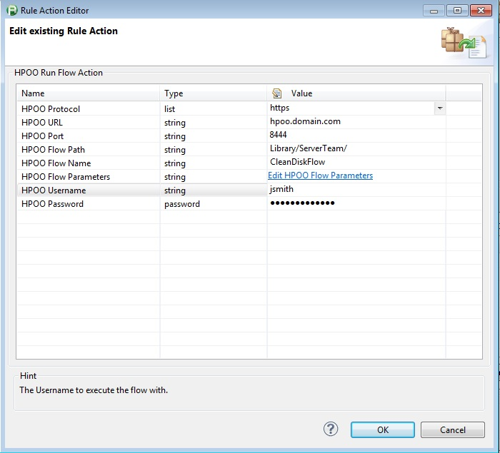

<html xmlns="http://www.w3.org/1999/xhtml">
<head>
    <title>HPOO Action Plugin</title>
    <meta http-equiv="Content-Type" content="text/html; charset=UTF-8"/>
    <meta http-equiv="X-UA-Compatible" content="IE=EmulateIE8" />
    <meta content="Scroll Wiki Publisher" name="generator"/>
    <link type="text/css" rel="stylesheet" href="css/blueprint/liquid.css" media="screen, projection"/>
    <link type="text/css" rel="stylesheet" href="css/blueprint/print.css" media="print"/>
    <link type="text/css" rel="stylesheet" href="css/content-style.css" media="screen, projection, print"/>
    <link type="text/css" rel="stylesheet" href="css/screen.css" media="screen, projection"/>
    <link type="text/css" rel="stylesheet" href="css/print.css" media="print"/>
</head>
<body>
                <h1>HPOO Action Plugin</h1>
    

        <h2>Overview</h2>
    

    

    

            
        The HPOO Action Plug-in will allow you to call the HPOO REST interface to execute a specified work flow. Just add Action to your desired dynaTrace incident.    

    

        <table>
<thead class=" "></thead><tfoot class=" "></tfoot><tbody class=" ">    <tr>
            <td rowspan="1" colspan="1">
        

Name and Version    

            </td>
                <td rowspan="1" colspan="1">
        

HPOO Action Plugin    

            </td>
        </tr>
    <tr>
            <td rowspan="1" colspan="1">
        

Compatible with    

            </td>
                <td rowspan="1" colspan="1">
        

dynaTrace 5.x, 6.x    

            </td>
        </tr>
    <tr>
            <td rowspan="1" colspan="1">
        

Author    

            </td>
                <td rowspan="1" colspan="1">
        

Brian Perrault    

            </td>
        </tr>
    <tr>
            <td rowspan="1" colspan="1">
        

<a href="https://community/display/DL/Licenses">License</a>    

            </td>
                <td rowspan="1" colspan="1">
        

<a href="attachments_5275722_2_dynaTraceBSD.txt">dynaTrace BSD</a>    

            </td>
        </tr>
    <tr>
            <td rowspan="1" colspan="1">
        

<a href="https://community/display/DL/Support+Levels">Support Level</a>    

            </td>
                <td rowspan="1" colspan="1">
        

<a href="https://community/display/DL/Support+Levels">Community Supported</a>    

            </td>
        </tr>
    <tr>
            <td rowspan="1" colspan="1">
        

Download    

            </td>
                <td rowspan="1" colspan="1">
        

<a href="attachments_174754306_1_com.hpoo.runFlow_1.0.0.jar">com.hpoo.runFlow_1.0.0.jar</a>    

            </td>
        </tr>
    <tr>
            <td rowspan="1" colspan="1">
        

Screenshots    

            </td>
                <td rowspan="1" colspan="1">
        

    

    

        <table>
<thead class=" "></thead><tfoot class=" "></tfoot><tbody class=" ">    <tr>
            <td rowspan="1" colspan="1">
        

            
            

            </td>
                <td rowspan="1" colspan="1">
        

            
            

            </td>
        </tr>
    <tr>
            <td rowspan="1" colspan="1">
                </td>
                <td rowspan="1" colspan="1">
                </td>
        </tr>
    <tr>
            <td rowspan="1" colspan="1">
        

            
            

            </td>
                <td rowspan="1" colspan="1">
                </td>
        </tr>
    <tr>
            <td rowspan="1" colspan="1">
                </td>
                <td rowspan="1" colspan="1">
                </td>
        </tr>
</tbody>        </table>
            

            </td>
        </tr>
    <tr>
            <td rowspan="1" colspan="1">
        

Installation    

            </td>
                <td rowspan="1" colspan="1">
        

Import the plugin on the dynaTrace Server. For more details see <a href="https://community.compuwareapm.com/community/display/DOCDT60/Plugins">Plugins</a>    

    

Once installed on the dynaTrace Server you can use the plugin as an action for your Incident. You need to switch to the Advanced Action Configuration. The plugin requires several properties to be configured. See the description of the properties in the section below    

            </td>
        </tr>
</tbody>        </table>
            

    

    

    

    

        <h2>dynaTrace Plug-in configuration Options</h2>
<ul class=" "><li class=" ">    

<strong class=" ">HPOO Protocol &ndash;</strong> Choose either the unsecured HTTP or the secured HTTPS protocol to connect to the HPOO web service with.    

</li><li class=" ">    

<strong class=" ">HPOO URL &ndash;</strong> The main URL used to connect to HPOO.  (EX: hpoo.domain.com)    

</li><li class=" ">    

<strong class=" ">HPOO Port &ndash; </strong>The port used for connecting to the HPOO web service. (Default: 8444)    

</li><li class=" ">    

<strong class=" ">HPOO Flow Path &ndash;</strong> The directory path to the desired flow. (EX: Library/ServerTeam/)    

</li><li class=" ">    

<strong class=" ">HPOO Flow Name &ndash;</strong> The name of the HPPO flow to be run.    

</li><li class=" ">    

<strong class=" ">HPOO Username &ndash;</strong> The username of the user to execute the HPOO Flow.  This user must have execute access for the desired flow in the desired HPOO environment    

</li><li class=" ">    

<strong class=" ">HPOO Password &ndash;</strong> The password for the user that will be executing the HPOO Flow.    

</li><li class=" ">    

<strong class=" ">HPOO Flow Parameters &ndash;</strong> The parameters to pass to the HPOO flow.  Parameters should be added to the list in the format of &ldquo;parameter=value&rdquo; (EX: port=22) and separated by a line end.  Several values can be extracted from the incident.  To use these simply place the specified key into the value portion of the parameter list (EX: parameter={$host}).    

<ul class=" "><li class=" ">    

<strong class=" ">{$host} &ndash; </strong>The Fully Qualified DNS for the server or URL that caused the incident to alert    

</li><li class=" ">    

<strong class=" ">{$guid} &ndash;</strong> The GUID string provided by dynaTrace to identify each individual incident. This can be used for talking with the dynaTrace REST interface    

</li><li class=" ">    

<strong class=" ">{$agent} &ndash;</strong> If the alert was generated from a dynaTrace instrumented application, this will provide the name of the application, otherwise this will return &ldquo;&rdquo;    

</li><li class=" ">    

<strong class=" ">{$incident} &ndash;</strong> The name of the incident that was tripped    

</li><li class=" ">    

<strong class=" ">{$startTime} &ndash;</strong> The time that the incident was tripped in dynaTrace    

</li><li class=" ">    

<strong class=" ">{$severity} &ndash;</strong> The severity of the incident as set in dynaTrace.  The 3 levels are Error, Warning, and Informational.    

</li><li class=" ">    

<strong class=" ">{$profile} &ndash;</strong> The name of the dynaTrace system profile that contains the incident    

</li><li class=" ">    

<strong class=" ">{$dynaTrace} &ndash;</strong> The URL for the dynaTrace server that tripped the alert.  This can be used for talking with the dynaTrace REST interface    

</li><li class=" ">    

<strong class=" ">{$instance} &ndash; </strong>If the dynaTrace measure is dynamic, this will contain the name of the dynamic instance (EX: drive name, network adapter name, service name)    

</li><li class=" ">    

<strong class=" ">{$instanceType} &ndash;</strong> If the dynaTrace measure is dynamic, this will contain the type of dynamic measure (EX: service, drive, interface, PID)    

</li><li class=" ">    

<strong class=" ">{$measureValue} &ndash;</strong> The value of the measure that caused the threshold to be breached    

</li><li class=" ">    

<strong class=" ">{$measureUnit} &ndash;</strong> The unit for the measure that caused the threshold to be breached    

</li><li class=" ">    

<strong class=" ">{$thresholdValue} &ndash;</strong> The value set on the threshold for the violated measure    

</li><li class=" ">    

<strong class=" ">{$incidentMessage} &ndash; </strong>The message from the incident details    

</li></ul></li></ul>    

            

        

        

        

    

</body>
</html>
